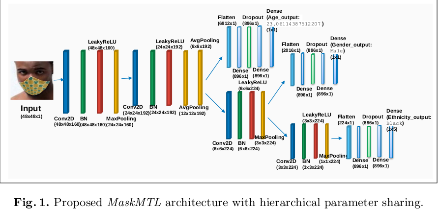

# MaskMTL: Attribute prediction in masked facial images with deep multitask learning
<div align=center>

</div>

## INTRO
**[Technical Report(link)]** **[ARXIV]**
...

## ARCHITECTURE DIAGRAM
OUR MaskMTL architecture

<div align=center>

</div>

## REQUIREMENTS
```
python 3.7
tensorflow
opencv-python
matplotlib
pandas
tensorflow.keras
```

## DATASET
The dataset used in the paper can be downloded from links.
[Images]()   [Labels](https://drive.google.com/file/d/10YXRLApAaCFYlaW3qpBNq6UUZ1D2WnqR/view?usp=sharing)

## USAGE/CODE FOR USE
1. code.ipynb provided has model reparation, training, evaluation and prediction by model. Refer that to train model on your dataset.
2. Use pretrained model given in **PRETRAINED MODEL** section below, to get predictions on masked facial images.
 
## PREDICTION PERFORMANCE
(https://github.com/dk-github-acc/Attribute-prediction-in-masked-facial-images-with-deep-multitask-learning/blob/3aeae38bd28fd4b34a5f7216d5972dd493344563/Images/mask_mtl_architecture.png)

## PRETRAINED MODEL
The pretrained model can be downloaded [here](https://drive.google.com/file/d/1g9zaYqbcP9ifyeIaOEHWITSowePwkbXv/view?usp=sharing) and used directly for prediction.

## LICENSE
...

## TEAM(remove if paper ss is used)
by, at
...

## CITE
Please cite our paper if you use or refer this code:

```
@inproceedings{wang2019diagnosis,
  title={MaskMTL: Attribute prediction in masked facial images with deep multitask learning},
  author={Prerana Mukherjee, Vinay Kaushik, Ronak Gupta, Ritika Jha, Daneshwari Kankanwadi, and Brejesh Lall},
  booktitle={PREMI2021},
  year={2021}
}
```
